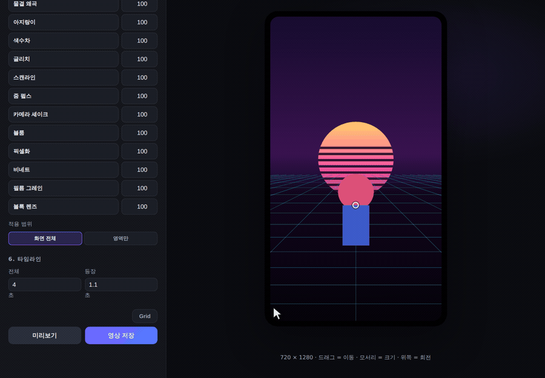
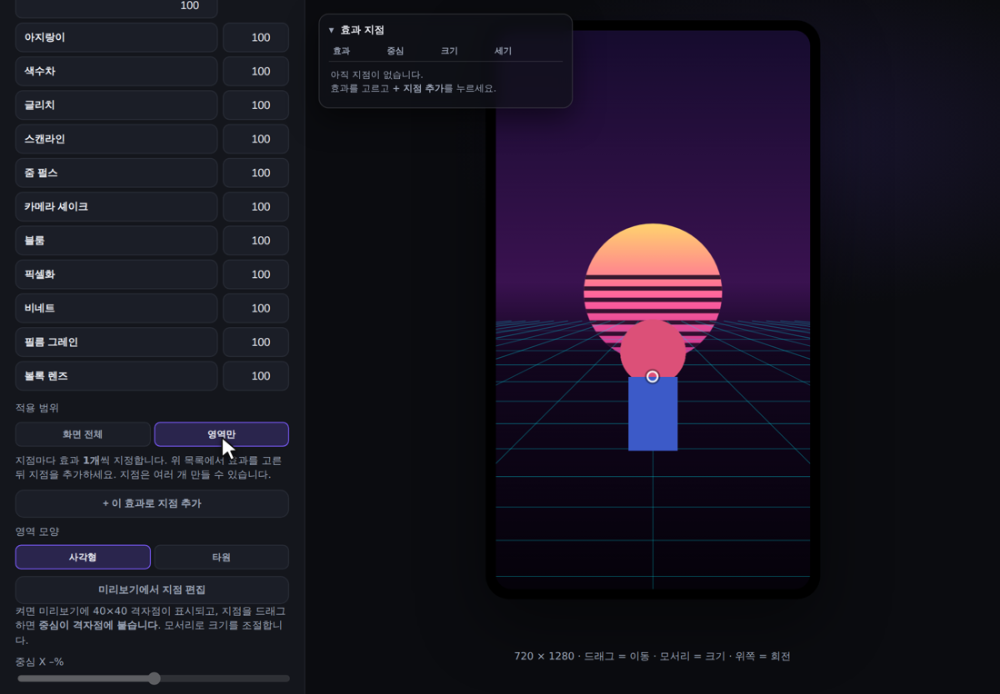
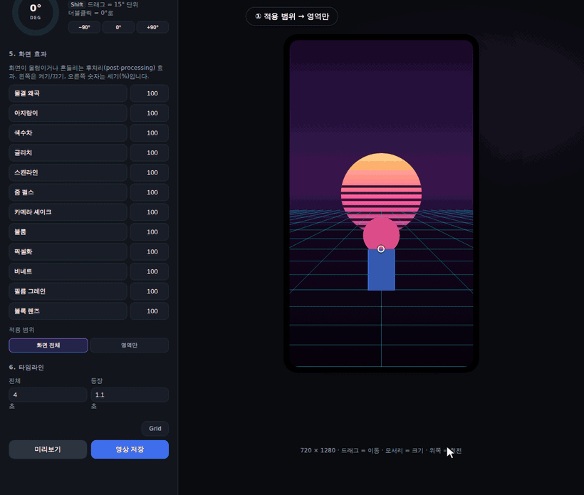

# Portrait Studio (`/mov`)

CSS/Canvas 배경 애니메이션 위에 배경이 제거된 캐릭터 이미지를 등장시켜 세로 영상(webm)을 만드는 페이지.

원래 `~/stmx/style-ID-movie-studio` 의 단독 HTML 도구였고, 이 저장소의 `/mov` 라우트로 옮겨졌습니다. 조작·렌더·저장 동작은 그대로입니다.

---

## 열기

```bash
npm run dev
```

브라우저에서 **http://localhost:8920/mov**. 스튜디오 헤더의 `Portrait Studio` 버튼으로도 갑니다.

세션 가드(`proxy.ts`) 뒤에 있으므로 **로그인이 필요합니다** — 로그인하지 않았다면 `/login` 으로 보내집니다.

코드를 고치면 Next 의 HMR 이 바로 반영합니다. 상태를 처음부터 다시 잡고 싶으면 패널 아래 `초기화`.

---

## 브라우저 요구사항

**Chrome을 권장합니다.** 영상 저장이 `MediaRecorder` + `canvas.captureStream()`으로 webm을 만드는데, Safari는 webm 녹화 지원이 제한적입니다.

- Chrome / Edge — 전체 기능 동작 (VP9 우선, 미지원 시 VP8로 자동 대체)
- Safari — 편집·미리보기는 되지만 **영상 저장이 실패할 수 있음**

### 저장이 느리거나 끊긴다면

`영상 저장`은 **실시간 녹화**입니다. 3초짜리면 최소 3초가 걸리고, 그 동안 상태줄에 진행률(`녹화 중… 45% (52프레임)`)이 표시됩니다.

녹화가 시작되면 **`영상 저장` 버튼이 빨간 `■ 중지` 버튼으로 바뀝니다.** 누르면 남은 시간을 기다리지 않고 즉시 멈추며, **그 시점까지 찍힌 만큼 저장**됩니다 (`중지 · 2.2초 저장 · …`). 10초짜리를 걸어놓고 2초 만에 멈춰도 2초짜리 영상이 그대로 나옵니다. 끝나면 버튼은 다시 `영상 저장`으로 돌아갑니다.

효과를 여러 개 켜거나 캔버스가 크면 프레임을 다 못 그려 영상이 끊길 수 있습니다. 이를 막기 위해 **녹화 직전과 녹화 중에 프레임 비용을 재서 내부 렌더 해상도를 자동으로 낮춥니다** (출력 해상도는 그대로). 이때 상태줄에 `내부 렌더 65%`처럼 표시됩니다 — 약간 부드러워지는 대신 영상이 끊기지 않습니다.

그래도 fps가 낮으면 효과 수를 줄이거나 캔버스를 작게 하세요.

저장된 `.webm`을 macOS에서 재생하려면 IINA/VLC를 쓰거나 mp4로 변환합니다:

```bash
# Homebrew로 ffmpeg 설치 후
ffmpeg -i portrait-aurora-720x1280-1234567890.webm -c:v libx264 -pix_fmt yuv420p out.mp4
```

> 저장 버튼은 브라우저 다운로드를 씁니다. 파일은 브라우저의 기본 다운로드 폴더로 떨어집니다.

---

## 가이드로 만들기 (권장)

패널 맨 위의 **`✦ 가이드로 만들기`** 를 누르면 대화식 가이드가 시작됩니다.

미리보기 아래에 질문 카드가 뜨고, **지금 눌러야 할 컨트롤에 주황 그라디언트 테두리가 흐르며 통통 튑니다.** 접혀 있는 섹션이면 자동으로 펼치고 그 위치까지 스크롤합니다.

```
배경 이미지가 있나요?
  ├ 있어요  → 이미지를 고를 때까지 기다렸다가 → 사진 위에 움직임을 더할까요?
  │                                              ├ 네  → 배경 애니메이션 고르기
  │                                              └ 아니요 → 사진만 (애니메이션 없음으로 설정)
  └ 없어요  → 배경 애니메이션 고르기
             ↓
캐릭터 이미지를 넣을까요?
  ├ 넣을게요 → 고를 때까지 대기 → 등장 애니메이션 → 위치·크기 잡기
  └ 배경만 만들래요
             ↓
화면 효과를 넣을까요?  [화면 전체에 / 일부 영역에만 / 안 넣을래요]
             ↓
영상 길이 → 미리보기 → 영상 저장
```

이미지 선택처럼 **사용자가 실제로 끝내야 하는 단계는 자동으로 감지해 다음으로 넘어갑니다.** 선택지에 따라 설정이 바로 반영되기도 합니다 (예: "사진만" 을 고르면 배경 애니메이션이 `없음`으로 설정됨).

언제든 카드 오른쪽 위 `✕` 나 시작 버튼을 다시 눌러 끝낼 수 있고, 가이드 없이 아래 순서대로 직접 만들어도 됩니다.

## 사용 흐름

1. **캔버스 크기** — 프리셋(720×1280 / 1080×1920 / 1080×1350 / 1080×1080 / 1280×720 / 1920×1080) 또는 W·H 직접 입력
2. **배경** — 애니메이션 24종 중 선택하거나 맨 끝의 **애니메이션 없음**. **배경 이미지**를 고르면 캔버스를 꽉 채우고(cover) 그 위에서 애니메이션이 돕니다(강도 조절 가능). 반복 회수(전체 시간 동안 몇 바퀴)와 색조(색상·강도·합성방식)도 여기서 조절
3. **캐릭터 이미지** (선택 사항) — 이미지를 고르면 배경이 자동 제거됨. 제거 강도·처리 해상도 조절. **넣지 않아도 됩니다** — 배경과 화면 효과만으로 미리보기·영상 저장이 됩니다
4. **등장 애니메이션** — 20종 중 선택
5. **종착 위치** — 미리보기에서 직접 드래그(이동) / 모서리 핸들(크기) / 위쪽 핸들(회전), 또는 패널의 슬라이더와 회전 다이얼
6. **화면 효과** — 후처리(post-processing) 12종을 여러 개 동시에 토글. 화면 전체 또는 화면 일부에만 적용 (→ [부분 효과 지정하는 방법](#부분-효과-지정하는-방법))
7. **타임라인** — 전체 길이와 등장 구간 길이
8. **미리보기** → **영상 저장**

### 화면 효과 12종

화면이 울렁이거나 흔들리는 효과는 통칭 **후처리(post-processing) / 화면 왜곡(screen distortion)** 이라고 부릅니다.

| 효과 | 정식 명칭 | 설명 |
|---|---|---|
| 물결 왜곡 | Wave / Ripple distortion | 가로 띠를 sin으로 밀어 화면이 울렁임 |
| 아지랑이 | Heat haze / shimmer | 촘촘하고 약한 굴절, 열기 아지랑이 |
| 색수차 | Chromatic aberration | R/B 채널을 좌우로 벌림 |
| 글리치 | Glitch / datamosh | 가로 블록이 어긋나고 색이 밀림 |
| 스캔라인 | CRT scanlines | 주사선 + 굴러가는 밝은 띠 |
| 줌 펄스 | Zoom pulse / breathing | 화면이 숨 쉬듯 확대·축소 |
| 카메라 셰이크 | Camera shake | 화면 전체가 흔들림 |
| 블룸 | Bloom / glow | 밝은 부분이 번짐 |
| 픽셀화 | Pixelate / mosaic | 모자이크 |
| 비네트 | Vignette | 가장자리를 어둡게 |
| 필름 그레인 | Film grain | 필름 입자 노이즈 |
| 볼록 렌즈 | Barrel / fisheye | 가운데가 볼록하게 부풀어 보임 |

효과 목록은 한 줄이 반으로 나뉘어 **왼쪽은 켜기/끄기 토글, 오른쪽은 세기(%) 숫자 입력**(10~300)입니다. 세기는 효과마다 따로 기억되므로 물결 150%, 블룸 60%처럼 동시에 다른 값을 둘 수 있습니다.

---

## 부분 효과 지정하는 방법

화면 일부에만 효과를 주려면 **지점(spot)** 을 만듭니다. 지점은 `효과 1개 + 위치 + 크기 + 모양 + 세기`를 묶은 단위이고, **여러 개를 만들 수 있습니다.**

> 한 지점에는 효과를 **하나만** 지정합니다. 같은 자리에 두 효과를 겹치고 싶으면 같은 위치에 지점을 두 개 만드세요.

### 1. 범위를 `영역만`으로 바꾼다

`5. 화면 효과` → **적용 범위** 에서 `영역만`을 누릅니다.



효과 목록 바로 아래, `6. 타임라인` 바로 위에 **적용 범위** 가 있습니다. 기본값은 `화면 전체`이고, 그 오른쪽 버튼이 `영역만`입니다.



누르면

- 효과 목록이 **단일 선택**으로 바뀝니다 (여러 개 토글이 아니라, 다음에 만들 지점에 쓸 효과 하나를 고르는 용도).
- 미리보기 왼쪽 위에 **효과 지점** 오버레이 표가 나타납니다.
- `화면 전체`에서 켜 두었던 토글은 **무시됩니다.** 영역 모드에서는 오직 지점 목록만 적용됩니다.

### 2. 효과를 고르고 지점을 추가한다

1. 효과 목록에서 쓸 효과를 클릭합니다 (선택된 것은 청록색 테두리).
2. 오른쪽 숫자로 세기를 정합니다 — 이 값이 새 지점의 초기 세기가 됩니다.
3. **`+ 이 효과로 지점 추가`** 를 누릅니다.

새 지점의 기본값은 `중심 35,35` · `크기 30×20%` · `사각형` · `경계 8%` 이고, 계속 추가하면 겹치지 않도록 오른쪽·아래로 15%씩 어긋나 배치됩니다.

### 3. 위치와 크기를 잡는다 — 40×40 격자

**`미리보기에서 지점 편집`** 을 켭니다. 미리보기에 주황색 **격자점**이 깔립니다.

- 화면을 가로·세로 **40칸**으로 나눈 격자입니다. 한 칸 = **2.5%**, 격자점은 41×41개.
- 지점 안쪽을 **드래그**하면 **중심이 가장 가까운 격자점에 붙습니다.**
- 네 **모서리 핸들**을 끌면 크기가 바뀝니다. 반대편 모서리는 고정되고, 크기도 2.5% 단위로 붙습니다.
- 패널의 `중심 X` / `중심 Y` / `너비` / `높이` 슬라이더로도 같은 조절이 됩니다. 라벨 옆에 `격자 15/40`처럼 몇 번째 격자칸인지 표시됩니다.

**중심점 표시** — 사각형이든 타원이든 지점의 정중앙에 **십자 마커와 흰 점**이 찍히고, 옆에 `19,13 (47.5, 32.5%)` 형식으로 **격자 칸 번호와 % 좌표**가 함께 표시됩니다. 편집을 켜면 중심을 지나 스테이지를 가로지르는 **정렬 가이드선**도 나타나 다른 요소와의 정렬을 눈으로 맞출 수 있습니다. 지점이 화면 가장자리에 있으면 좌표 라벨이 자동으로 반대쪽으로 접혀 잘리지 않습니다.

편집을 켜 두는 동안에는 마우스가 **지점**을 조작합니다. 캐릭터를 다시 옮기려면 이 버튼을 **끄세요.**

### 4. 모양과 경계를 다듬는다

| 항목 | 설명 |
|---|---|
| **영역 모양** | `사각형` 또는 `타원`. 인물 얼굴 주변처럼 둥근 범위에는 타원이 자연스럽습니다. |
| **경계 부드럽게** | 0~40%. 0이면 경계가 칼같이 잘리고, 값을 올리면 효과가 서서히 사라지며 배경에 녹아듭니다. 720×1280에서 40%는 약 144px 번짐입니다. |

경계를 0으로 두면 사각형 자국이 그대로 보이므로, 자연스럽게 섞으려면 **8~20%** 정도를 권합니다.

### 5. 지점 목록 표에서 관리한다

미리보기 왼쪽 위 **반투명 오버레이**(modeless — 다른 조작을 막지 않음)에서 관리합니다.

| 열 | 내용 |
|---|---|
| 효과 | 이 지점에 걸린 효과 이름 |
| 중심 | 격자 좌표 (예: `20,9` = 가로 20번째, 세로 9번째 격자점) |
| 크기 | 너비×높이 (%) |
| 세기 | 이 지점만의 세기 |
| ✕ | 이 지점 삭제 |

- **줄을 클릭**하면 그 지점이 편집 대상이 됩니다 (주황색으로 표시되고, 미리보기의 박스와 슬라이더가 그 지점으로 바뀝니다).
- 활성 지점이 선택된 상태에서 효과 목록의 **숫자를 고치면 그 지점의 세기**가 바뀝니다.
- 오버레이가 미리보기를 가리면 **제목 줄(`▾ 효과 지점`)을 클릭**해 접을 수 있습니다.

### 겹칠 때의 순서

지점은 **목록 순서대로 위에 쌓입니다.** 아래쪽 지점의 효과는 그 앞 지점들의 결과 위에 적용되므로, 같은 자리에 `픽셀화 → 비네트` 순서와 `비네트 → 픽셀화` 순서는 결과가 다릅니다.

### 전체 과정 — 지점 2개 만들기

사각형 지점(픽셀화)을 만들어 위치를 잡고 **확대**한 뒤, 타원 지점(블룸)을 **기본 크기의 1/2**로 만드는 전 과정입니다.



| 단계 | 동작 | 결과 |
|---|---|---|
| ① | 적용 범위 → `영역만` | 지점 모드 진입 |
| ② | 효과 목록에서 `픽셀화` 선택 | 다음 지점에 쓸 효과 |
| ③ | `+ 이 효과로 지점 추가` | 지점 1 생성 (기본 30×20) |
| ④ | 영역 모양 `사각형` | |
| ⑤ | `미리보기에서 지점 편집` ON | 40×40 격자점 표시 |
| ⑥ | 지점을 드래그 | 중심이 격자점에 붙음 |
| ⑦ | 모서리 핸들을 바깥으로 드래그 | **30×20 → 65×40 확대** |
| ⑧ | 효과 목록에서 `블룸` 선택 | |
| ⑨ | `+ 지점 추가` | 지점 2 생성 (기본 30×20) |
| ⑩ | 영역 모양 `타원` | |
| ⑪ | 모서리를 안쪽으로 드래그 | **30×20 → 15×10 (기본의 1/2)** |

크기는 2.5% 단위로 붙으므로 `15×10`처럼 정확한 값에 딱 맞출 수 있습니다. 오른쪽 위 표에서 두 지점이 `픽셀화 65×40` / `블룸 15×10` 으로 관리되는 것을 볼 수 있습니다.

### 예시 — 얼굴만 모자이크 + 아래쪽만 흔들기

```
적용 범위:  영역만

1) 픽셀화 선택 → 세기 60 → + 지점 추가
   지점 편집 ON → 얼굴 위로 드래그 → 모양 타원 → 경계 12%
2) 카메라 셰이크 선택 → 세기 150 → + 지점 추가
   중심 Y 를 아래쪽 격자로 → 너비 100% / 높이 40%
```

지점이 하나도 없으면 영역 모드에서는 아무 효과도 적용되지 않습니다.

---

## 설정 저장 / 불러오기

패널 맨 아래 고정 바에 있습니다.

- **자동 저장** — 조작한 설정은 2초마다 브라우저에 저장되고(`localStorage` 의 `portrait-studio.settings.v1`), 다음에 열면 그대로 복원됩니다 (`이전 설정을 불러왔습니다`). 이미지는 용량 때문에 제외됩니다. 서버가 아니라 브라우저에 저장되므로 계정과 무관하고 기기 간에 공유되지 않습니다.
- **내보내기** — 현재 설정을 JSON 파일로 저장합니다. **캐릭터 이미지와 배경 이미지까지 포함**하므로 다른 컴퓨터에서 그대로 재현됩니다.
- **가져오기** — 내보낸 JSON 을 불러옵니다. 설정·이미지·지점 목록이 전부 복원됩니다.
- **초기화** — 저장된 설정을 지우고 처음 상태로 되돌립니다.

## 패널 다루기

- 섹션 제목(`1. 배경 애니메이션` 등)을 **클릭하면 접힙니다.** 접은 상태는 기억됩니다.
- `미리보기` · `영상 저장` · `Grid` · 설정 버튼과 상태 표시줄은 **패널 아래에 고정**되어 있어 어디까지 스크롤하든 바로 누를 수 있습니다.

## 미리보기 단축키

캐릭터를 클릭해 선택한 뒤:

| 키 | 동작 |
|---|---|
| 방향키 | 0.5% 이동 |
| `Shift` + 방향키 | 5% 이동 |
| `+` / `-` | 크기 조절 |
| `,` / `.` | 1° 회전 (`Shift`와 함께 15°) |
| `Esc` | 선택 해제 |

드래그 중 `Shift`는 축 고정, 핸들 드래그 중 `Shift`는 중심 고정입니다.

---

## 파일 구조

```
vtron/
├── app/mov/
│   ├── page.tsx                # 마크업 (원본 index.html 을 JSX 로)
│   ├── mov.css                 # 스타일 (원본 styles.css 를 .mov-app 아래로 스코프)
│   └── layout.tsx              # <title> 등 메타데이터
├── lib/mov/
│   ├── portrait-studio.js      # 로직 전부 (원본 app.js → initPortraitStudio(root))
│   └── portrait-studio.d.ts
├── test/mov/                   # 검증 스위트 (93개 항목)
│   ├── run.mjs
│   ├── package.json
│   └── README.md
└── docs/
    ├── portrait-studio.md      # 이 문서
    └── portrait-studio/        # 스크린샷·GIF
```

**어디를 고치는가**

| 고칠 것 | 파일 |
|---|---|
| 배경 24종 · 등장 20종 · 효과 12종, 렌더 파이프라인, 조작, 저장 | `lib/mov/portrait-studio.js` |
| 패널에 컨트롤 추가/삭제 | `app/mov/page.tsx` + 모듈의 `$("id")` 양쪽 |
| 색·간격·레이아웃 | `app/mov/mov.css` (모든 규칙이 `.mov-app` 아래) |

`page.tsx` 는 상태를 React 로 들고 있지 **않습니다.** 미리보기와 내보내기가 같은 페인터를 공유하는 것이 이 도구의 핵심 불변식이라, 마크업만 JSX 로 옮기고 렌더 루프와 포인터 조작은 원본 그대로 DOM 을 직접 다룹니다. `useEffect` 가 `initPortraitStudio(root)` 를 붙이고, 언마운트 때 정리 함수가 rAF 루프·자동저장 타이머·`beforeunload` 를 회수합니다.

## 검사

코드를 고친 뒤에는 검증 스위트를 돌립니다. 서버를 띄워 둔 상태여야 합니다.

```bash
cd test/mov && npm install && npm test
```

배경 24종의 루프 이음매·움직임, 등장 20종의 끝 포즈, 효과 12종, 부분 효과 마스킹, **미리보기 == 내보내기 픽셀 일치**, 설정 저장/복원, 실제 webm 생성, 그리고 마크업과 모듈이 찾는 id 의 동기화까지 검사합니다. 자세한 내용은 [test/mov/README.md](../test/mov/README.md).

### 구조상 알아둘 점

- **캔버스는 GPU 가속 경로를 유지합니다.** 출력용 캔버스(미리보기 `#fx`, 녹화 캔버스, 전체가 칠해지는 스크래치)는 `alpha: false` 불투명 서피스로 만들어 알파 합성을 건너뜁니다. `willReadFrequently` 는 **배경 제거 한 곳에서만** 씁니다 — 이 플래그를 켠 캔버스는 Chrome 이 소프트웨어 렌더로 내리므로 그리기 경로에는 절대 쓰지 않습니다. 효과 파이프라인에는 `getImageData` 리드백이 없습니다.
- **미리보기 전체가 한 장의 캔버스입니다.** 배경·캐릭터·화면효과가 모두 `#fx` 캔버스에 그려지고, 내보내기도 `paintBg() → drawCharacter() → applyEffects()` 같은 순서를 씁니다. 그래서 보이는 그대로 저장됩니다.
- **배경 합성 순서는 이미지 → 애니메이션(screen) → 색조** 입니다. 배경 애니메이션들이 "어두운 바탕 위의 빛 효과"라서, screen으로 얹으면 검은 바탕은 사라지고 빛나는 요소만 사진 위에 남습니다.
- **배경은 한 벌만 있습니다.** 미리보기(`#fx` 캔버스)와 영상 저장이 똑같은 `paintBg()`를 호출하므로, 보이는 그대로 저장됩니다. 배경을 추가·수정할 때는 `lib/mov/portrait-studio.js` 의 `paintBgBase()` 한 곳만 고치면 됩니다.
- **배경 페인터의 `t`는 초가 아니라 루프 위상입니다.** `t`가 0→1이면 한 바퀴. 그래서 새 배경은 `Math.sin(t * TAU * 정수)`, `wrap(t * 정수 + offset)` 형태로 써야 이음매 없이 반복됩니다.
- **조작 계산은 px, 렌더는 %**로 나뉘어 있습니다. 회전이 들어가면 %공간(가로·세로 스케일이 다름)에서는 각도가 왜곡되기 때문입니다.
- 캐릭터 배율 상한은 회전 후 외접 사각형이 캔버스를 넘지 않도록 자동 계산됩니다(`maxScaleFor`).
